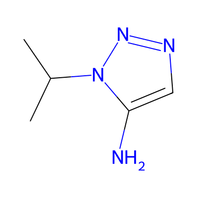
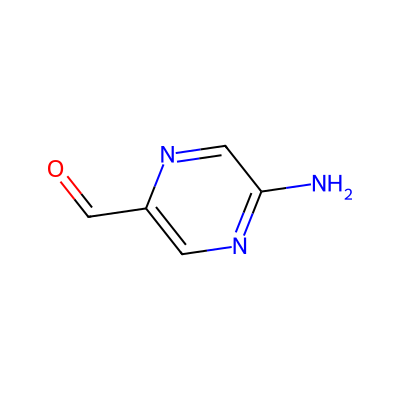
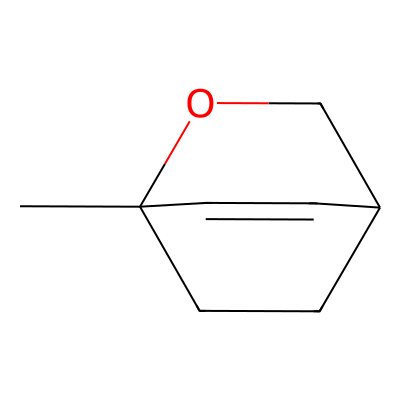
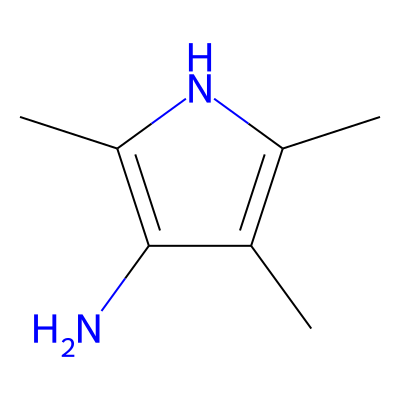
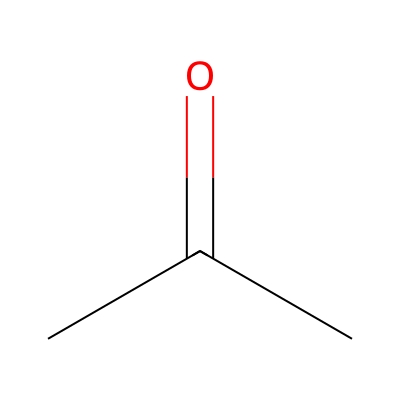
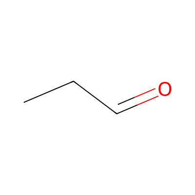

# LatentMol — Odd-One-Out-Quiz

Kleine Web-App zur **Jufo-Präsentation**: Vier Moleküle, du suchst den Ausreißer — danach siehst du, wie das Modell entschieden hat und welche **funktionellen Gruppen** den Unterschied erklären können.

Kein Chemie-Vorwissen nötig. Die kuratierten fünf Sets dauern etwa zwei Minuten.

## Was du siehst

| Schritt | Inhalt |
|--------|--------|
| 1 | Vier Strukturbilder — welches Molekül passt **nicht** zur Gruppe? |
| 2 | Deine Wahl vs. Modell — stimmt die Vorhersage? |
| 3 | Kurz erklärt: funktionelle Gruppen (klickbare Chips mit Popup) und optional die **PEA-Matrix** (wie Quellen in die Darstellung einfließen) |

Beispiel eines kuratierten Sets (Ausreißer markiert im Spiel):

<p align="center">
  
  
  
  
</p>

Im Tutorial „Funktionelle Gruppen kurz erklärt“ vergleichst du Paare (z. B. Keton vs. Aldehyd):

<p align="center">
  
  
</p>

## Einstiege

- **Los geht's** — fünf fest ausgewählte Sets (`config.json`)
- **Weitere Sets (Pool)** — großer Bestand, Set-Nummer, Shuffle, Tastatur 1–4
- **Pool Speedrun** — drei Minuten, so viele Treffer wie möglich
- **Tutorial** und **Mehr zum KI-Modell** — Kontext ohne Quiz

Tastatur auf dem Startbildschirm: `1`–`5` für die Menüpunkte, im Quiz `1`–`4` für Moleküle, `H` zurück zum Hauptmenü.

## Lokal starten

Voraussetzung: Python 3, optional [RDKit](https://www.rdkit.org/) für Strukturbilder und FG-Erkennung beim Build.

```bash
python3 -m venv .venv
source .venv/bin/activate   # Windows: .venv\Scripts\activate
pip install rdkit-pypi       # optional, aber empfohlen

./serve.sh                   # baut dist/ und serviert http://localhost:8080
```

Hard-Refresh (`Strg+Shift+R`), falls der Browser alte Dateien cached.

Nur Build ohne Server:

```bash
python3 build.py             # dist/ und docs/
```

## Online (GitHub Pages)

Die öffentliche Version liegt unter **`docs/`** (Branch `main`, Ordner als Pages-Quelle). Nach dem Build ist sie dieselbe App wie `dist/`, nur für statisches Hosting.

`config.json` und die JSON-Daten unter `docs/data/` musst du nach inhaltlichen Änderungen per Build neu erzeugen und committen, damit die Live-Seite aktualisiert wird.

## Projektstruktur (kurz)

| Pfad | Rolle |
|------|--------|
| `src/` | HTML, CSS, JavaScript (Quelle) |
| `build.py` | JSON anreichern, Bilder, `dist/` + `docs/` |
| `config.json` | Welche Sets im Haupt-Quiz erscheinen |
| `dist/` | Lokaler Dev-Server (`serve.sh`, gitignored) |
| `docs/` | GitHub Pages Bundle (im Repo) |

## Daten

Inferenz-JSONs kommen aus der Jufo-Auswertung (`inference_{strategy}_set{n}.json`). Der Build ergänzt u. a. Strukturformeln, FG-Labels und Analyse für die Auflösungsansicht.

---

*LatentMol · Jugend forscht — interaktive Ergänzung zur Arbeit.*
